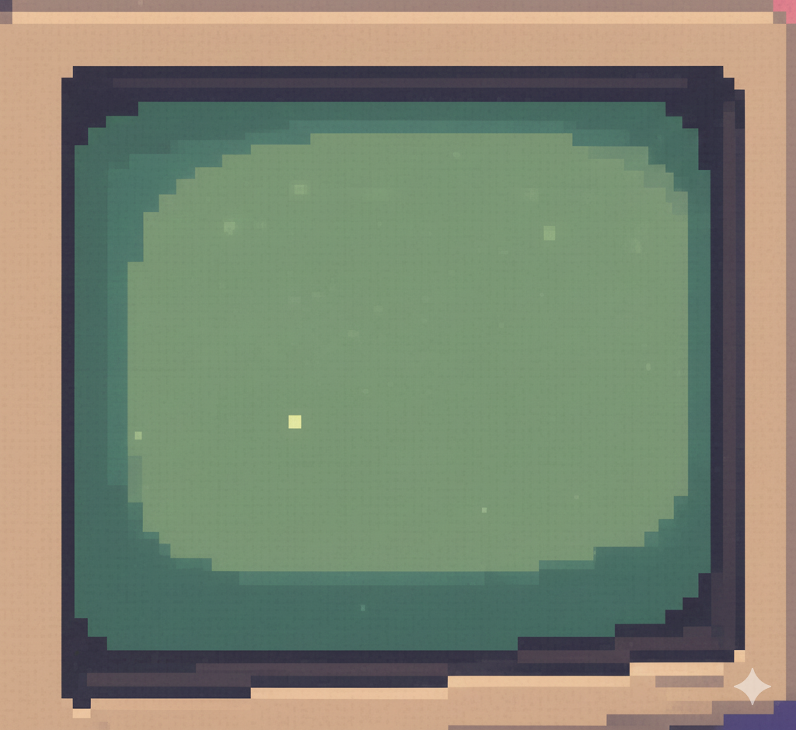

```{=html}
<div id="splash-screen">
  
  <div class="content-wrapper">
    
    
    <div class="monitor-screen">
      <div class="terminal-text">SELECT OPTION:</div>
      
      <div class="button-grid">
        <a href="projects.html" class="pixel-btn page-transition">
          > PROJECTS
        </a>
        
        <a href="classes.html" class="pixel-btn page-transition">
          > CLASSES
        </a>
        
        <a href="about.html" class="pixel-btn page-transition">
          > ABOUT
        </a>
        
        <a href="file/Fehl_Michael_CV.pdf" class="pixel-btn" target="_blank">
          > CV
        </a>
      </div>
      
    </div>
  </div>
</div>

<!-- Loading Bar -->
<div class="loader">
  <div class="bar1"></div>
  <div class="bar2"></div>
  <div class="bar3"></div>
  <div class="bar4"></div>
  <div class="bar5"></div>
  <div class="bar6"></div>
</div>

<style>
  /* --- BACKGROUND & LAYOUT --- */
  body {
    margin: 0; padding: 0; overflow: hidden;
    background: linear-gradient(180deg, 
        #6b5b95 0%, #c88ea7 40%, #eeb696 70%, #2d3a46 70%, #243038 100%
    );
    height: 100vh;
    font-family: 'Courier New', monospace;
    position: relative;
  }
  
  /* Page transition overlays - all four sides */
  body:before,
  body:after {
    content: '';
    position: fixed;
    background: #1c2020;
    z-index: 10000;
    transition: all 0.6s cubic-bezier(0.7, 0, 0.3, 1);
  }
  
  /* Top and bottom */
  body:before {
    top: 0;
    left: 0;
    right: 0;
    height: 0;
  }
  
  body:after {
    bottom: 0;
    left: 0;
    right: 0;
    height: 0;
  }
  
  body.is-changing:before,
  body.is-changing:after {
    height: 50vh;
  }
  
  /* Left and right sides */
  body {
    position: relative;
  }
  
  body::before {
    /* Reusing before for top */
  }
  
  #splash-screen:before,
  #splash-screen:after {
    content: '';
    position: fixed;
    background: #1c2020;
    z-index: 10000;
    width: 0;
    top: 0;
    bottom: 0;
    transition: width 0.6s cubic-bezier(0.7, 0, 0.3, 1);
  }
  
  #splash-screen:before {
    left: 0;
  }
  
  #splash-screen:after {
    right: 0;
  }
  
  body.is-changing #splash-screen:before,
  body.is-changing #splash-screen:after {
    width: 50vw;
  }
  
  #splash-screen {
    width: 100vw; height: 100vh;
    display: flex;
    justify-content: center;
    align-items: center;
    animation: fadeIn 0.5s ease-in;
  }
  
  /* Fade in animation on page load */
  @keyframes fadeIn {
    from {
      opacity: 0;
      transform: scale(0.95);
    }
    to {
      opacity: 1;
      transform: scale(1);
    }
  }
  
  .content-wrapper {
    position: relative;
    text-align: center;
    width: 500px;
    animation: slideUp 1s ease-out 0.3s backwards;
  }
  
  @keyframes slideUp {
    from {
      opacity: 0;
      transform: translateY(50px);
    }
    to {
      opacity: 1;
      transform: translateY(0);
    }
  }
  
  /* --- THE IMAGE --- */
  .laptop-img {
    width: 100%;
    image-rendering: pixelated; 
    display: block;
  }
  
  /* --- THE SCREEN OVERLAY --- */
  .monitor-screen {
    position: absolute;
    top: 35%;
    left: 0;
    width: 100%;
    text-align: center;
    z-index: 10;
  }
  
  /* --- THE TEXT & BUTTONS --- */
  .terminal-text {
    color: #50fa7b;
    font-size: 14px;
    margin-bottom: 15px;
    text-shadow: 1px 1px 0 #000;
    animation: blink 0.5s ease-in 1.2s backwards;
  }
  
  @keyframes blink {
    0%, 50% {
      opacity: 0;
    }
    100% {
      opacity: 1;
    }
  }
  
  /* --- 2x2 BUTTON GRID --- */
  .button-grid {
    display: grid;
    grid-template-columns: 1fr 1fr;
    gap: 10px;
    max-width: 280px;
    margin: 0 auto;
  }
  
  .pixel-btn {
    padding: 8px 0;
    
    background-color: #282a36;
    color: #50fa7b;
    border: 2px solid #50fa7b;
    
    text-decoration: none;
    font-weight: bold;
    font-size: 16px;
    cursor: pointer;
    box-shadow: 3px 3px 0px rgba(0,0,0,0.5);
    transition: all 0.1s;
    
    /* Stagger animation for buttons */
    opacity: 0;
    animation: fadeInButton 0.5s ease-out forwards;
  }
  
  .pixel-btn:nth-child(1) { animation-delay: 1.4s; }
  .pixel-btn:nth-child(2) { animation-delay: 1.6s; }
  .pixel-btn:nth-child(3) { animation-delay: 1.8s; }
  .pixel-btn:nth-child(4) { animation-delay: 2s; }
  
  @keyframes fadeInButton {
    from {
      opacity: 0;
      transform: translateX(-20px);
    }
    to {
      opacity: 1;
      transform: translateX(0);
    }
  }
  
  /* Hover Effect */
  .pixel-btn:hover {
    background-color: #50fa7b;
    color: #282a36;
    transform: translateY(2px);
    box-shadow: 1px 1px 0px rgba(0,0,0,0.5);
  }
  
  /* --- LOADING BAR ANIMATION --- */
  @keyframes delay {
    0%, 40%, 100% { 
      transform: scaleY(0.05);
      -webkit-transform: scaleY(0.05);
    }
    20% { 
      transform: scaleY(1.0);
      -webkit-transform: scaleY(1.0);
    }
  }
  
  .loader {
    margin: 0 auto;
    width: 60px;
    height: 50px;
    text-align: center;
    font-size: 10px;
    position: fixed;
    top: 50%;
    left: 50%;
    transform: translateY(-50%) translateX(-50%);
    z-index: 10001;
    opacity: 0;
    pointer-events: none;
    transition: opacity 0.3s ease;
  }
  
  .loader.is-visible {
    opacity: 1;
  }
  
  .loader > div {
    height: 100%;
    width: 8px;
    display: inline-block;
    float: left;
    margin-left: 2px;
    animation: delay 0.8s infinite ease-in-out;
  }
  
  .loader .bar1 {
    background-color: #754fa0;
  }
  .loader .bar2 {
    background-color: #09b7bf;
    animation-delay: -0.7s;
  }
  .loader .bar3 {
    background-color: #90d36b;
    animation-delay: -0.6s;
  }
  .loader .bar4 {
    background-color: #f2d40d;
    animation-delay: -0.5s;
  }
  .loader .bar5 {
    background-color: #fcb12b;
    animation-delay: -0.4s;
  }
  .loader .bar6 {
    background-color: #ed1b72;
    animation-delay: -0.3s;
  }
</style>

<script>
  document.addEventListener('DOMContentLoaded', function() {
    const transitionLinks = document.querySelectorAll('.page-transition');
    const loader = document.querySelector('.loader');
    const body = document.body;
    
    transitionLinks.forEach(link => {
      link.addEventListener('click', function(e) {
        e.preventDefault();
        const href = this.getAttribute('href');
        
        // Trigger body transition (top/bottom bars)
        body.classList.add('is-changing');
        
        // Show loading bar
        setTimeout(() => {
          loader.classList.add('is-visible');
        }, 200);
        
        // Navigate after animation completes
        setTimeout(() => {
          window.location.href = href;
        }, 800);
      });
    });
  });
</script>
```